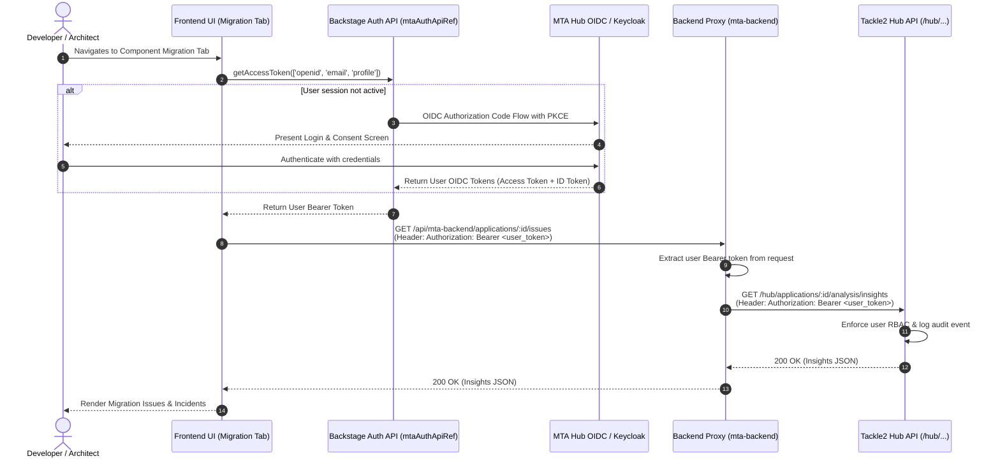
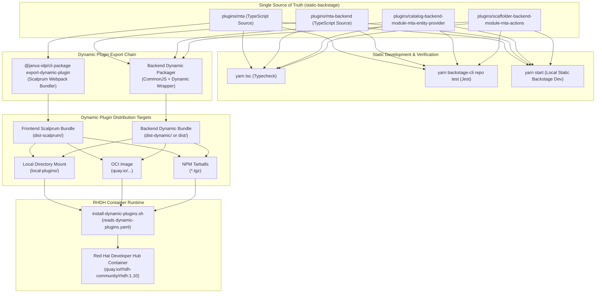
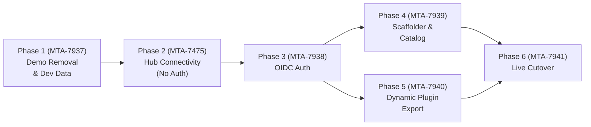

# Implementation Plan: Hooking MTA Plugins to a Live MTA Hub Instance
**Date:** 2026-09-24 (Updated from 2026-09-01)
**Base Repository:** `static-backstage` (Static Backstage Monorepo)
**Target Hub API Reference:** [`konveyor/tackle2-hub`](https://github.com/konveyor/tackle2-hub)
**Target RHDH Runtime:** Red Hat Developer Hub (Dynamic Plugins via Scalprum / Janus IDP)
**Jira Epic:** [MTA-7629](https://issues.redhat.com/browse/MTA-7629)

---

## Executive Summary

This document details the architectural and implementation plan to transition the **Migration Toolkit for Applications (MTA / Konveyor)** plugins from the current prototype implementation to a production-grade integration with a live **MTA Hub (Tackle2 Hub)** instance.

The plan is structured as **six phased Jira stories** under epic **MTA-7629**, each with trackable tasks. The progression is deliberately layered:

1. **Phase 1:** Remove the visible prototype switcher and global phase/persona overrides; keep the demo store and mock Hub working while setting up catalog-backed persona stories.
2. **Phase 2 ([MTA-7475](https://issues.redhat.com/browse/MTA-7475)):** Replace the frontend demo store with real Hub data (no auth) and refactor components for live data.
3. **Phase 3:** Layer on user-delegated OIDC authentication once the data path is proven.
4. **Phases 4–6:** Integrate scaffolder/catalog with the live Hub, export as dynamic plugins for RHDH, and run end-to-end cutover.

The architecture addresses three core requirements:
1. **User-Delegated Authentication (OIDC / OAuth2):** All user-initiated mutations and reads strictly forward the individual user's OIDC bearer token directly through to the MTA Hub. There is **no platform service account** for user actions, preserving Tackle2 RBAC and user-level audit trails. *(Introduced in Phase 3.)*
2. **Modern Data Fetching & Reactive State:** Phase 1 retains the in-memory demo store and mock Hub so registration and remediation stories remain runnable without the visible harness. Phase 2 replaces frontend demo state with a request-scoped backend proxy (`mta-backend`), `MtaApiClient`, and reactive hooks. The mock Hub remains for its scaffolder/catalog consumers until their Phase 4 cutover.
3. **Dual-Target Build Chain (Static Base → RHDH Dynamic Plugins):** Using the current `static-backstage` monorepo as the **Single Source of Truth (SSOT)**. The static plugins serve as the base for development and testing, while a dynamic plugin export step packages them into Scalprum-compatible dynamic plugins for deployment in Red Hat Developer Hub (RHDH). *(Phase 5.)*

---

## 1. Repository Structure & Current State

### Plugin Inventory & Location Mapping

| Plugin Role | Location (`static-backstage`) | Package Name | Status After Plan |
|---|---|---|---|
| **Frontend Plugin** | `plugins/mta` | `@internal/backstage-plugin-mta` | Modified (Phases 1–3) |
| **Backend Plugin (Proxy)** | `plugins/mta-backend` | `@internal/backstage-plugin-mta-backend` | Modified (Phases 2–3) |
| **Mock Hub Backend** | `plugins/mta-mock-hub-backend` | `@internal/backstage-plugin-mta-mock-hub-backend` | Retained for demos through Phase 3; deleted after Phase 4 cutover |
| **Catalog Entity Provider** | `plugins/catalog-backend-module-mta-entity-provider` | `@internal/backstage-plugin-catalog-backend-module-mta-entity-provider` | Modified (Phases 3–4) |
| **Scaffolder Actions Module** | `plugins/scaffolder-backend-module-mta-actions` | `@internal/backstage-plugin-scaffolder-backend-module-mta-actions` | Modified (Phases 3–4) |

### Before Phase 1 (Prototype State)

Before Phase 1, the plugin was a **self-contained demo** with no external Hub dependency:

- **`MtaStore.tsx`** — In-memory React context store with 5 hardcoded applications, mock archetypes, mock target profiles, mock issues, and mock action history. State persists via `sessionStorage`.
- **`mockData.ts`** — ~840 lines of hardcoded issue templates (Java EE, Spring, Node.js), deployment asset previews, DevSpaces config, and initial application data.
- **`plugins/mta/src/prototype/`** — Prototype harness directory:
  - `PrototypeScopeSwitcher.tsx` — Dark toolbar mounted as a secondary React root on `document.body`, controls scope (core/agentic/experience/enhancements), persona (architect/developer), and phase state overrides via `localStorage`.
  - `prototypeScope.ts` — DTUX ticket scope selector state.
  - `prototypePersona.ts` — Architect/developer persona toggle via `localStorage`.
  - `prototypePhaseState.ts` — Global phase, per-entity phase overrides, and generation counter for the scope switcher.
- **`plugins/mta-mock-hub-backend`** — Standalone backend plugin simulating Hub registration, discovery (20s delay), and entity YAML generation.
- **`DISCOVERY_DELAY_MS`** — 3s frontend demo discovery delay in `utils.ts`; the mock Hub independently waits 20s before reporting discovery.
- **`ACTION_TIMEOUT_MS`** — Artificial delay for mock action execution.

Phase 1 removes only the prototype switcher and its `localStorage` overrides. The demo store, data, simulated delays, and mock Hub remain until the live replacement covers their consumers (frontend in Phase 2; scaffolder/catalog in Phase 4).

---

## 2. Architecture Overview

```mermaid
flowchart TB
    subgraph Browser["User Browser (Static Backstage or RHDH)"]
        UI["Migration Tab & Home Cards<br/>(plugins/mta)"]
        AuthApi["Backstage Auth API<br/>(mtaAuthApiRef / OIDC)<br/><i>Phase 3</i>"]
        ApiClient["MtaApiClient<br/>(Bearer Token Forwarder)"]
        UI --> ApiClient
        ApiClient -.->|Phase 3| AuthApi
    end

    subgraph BackstageBackend["Backstage Backend Server (Port 7007)"]
        MtaBackend["mta-backend Proxy<br/>(/api/mta-backend/*)"]
        EntityProvider["mta-entity-provider<br/>(Catalog Sync)"]
        Scaffolder["mta-scaffolder-actions<br/>(mta:register-application)"]
    end

    subgraph MTA["MTA Hub (Tackle2 Hub)"]
        IdP["OIDC Provider / Keycloak SSO"]
        TackleAPI["Tackle2 REST API (/hub/...)"]
        AppReg["Application Registry"]
        Analyzer["Task Engine (Kantra Analyzer)"]
        Archetypes["Archetypes & Target Profiles"]
    end

    AuthApi -.->|1. User Login (PKCE) — Phase 3| IdP
    IdP -.->|2. User Bearer Token — Phase 3| AuthApi
    ApiClient -->|3. REST call (+ Bearer Token in Phase 3)| MtaBackend
    MtaBackend -->|4. Forward to Hub (+ Bearer Token in Phase 3)| TackleAPI
    Scaffolder -->|User-Scoped Token — Phase 3| TackleAPI
    EntityProvider -.->|Read-Only Sync — Phase 4| TackleAPI
    TackleAPI --> AppReg
    TackleAPI --> Analyzer
    TackleAPI --> Archetypes
```

---

## 3. Tackle2 Hub REST API Reference

Based on `konveyor/tackle2-hub` (`shared/api/*.go` and `shared/api/pkg.go`), the live MTA Hub exposes the following REST contracts under `/hub/`:

| Feature / Domain | Tackle2 Route | Method | Payload / Response Contract |
|---|---|---|---|
| **Application Inventory** | `/hub/applications`<br>`/hub/applications/:id` | `GET`<br>`POST` | **`TackleApplication`**: `{ id, name, description, repository: { kind, url, branch, path }, tags: TagRef[], identities: IdentityRef[], archetypes: Ref[] }` |
| **Archetypes & Match Criteria** | `/hub/archetypes`<br>`/hub/archetypes/:id` | `GET` | **`TackleArchetype`**: `{ id, name, description, criteria: TagRef[], tags: TagRef[], profiles: TargetProfile[] }` |
| **Target Profiles & Targets** | `/hub/targets`<br>`/hub/generators` | `GET` | **`TargetProfile`**: `{ id, name, generators: Ref[], analysisProfile: Ref }` |
| **Trigger Kantra Analysis** | `/hub/tasks` | `POST` | **`TackleTask`**: `{ addon: "analyzer", application: { id: appId }, data: { targets: string[], sources: string[], mode: { binary: false, withDeps: true } } }` |
| **Monitor Task Lifecycle** | `/hub/tasks/:id`<br>`/hub/tasks/:id/report` | `GET` | **`TackleTask`**: `{ id, state: "Created"\|"Pending"\|"Running"\|"Succeeded"\|"Failed", errors: TaskError[], started, terminated, activity: string[] }` |
| **Fetch Analysis Insights** | `/hub/applications/:id/analysis/insights` | `GET` | **`TackleInsight[]`**: `{ id, ruleset, rule, name, description, category, effort, incidents: IncidentRef[], links: Link[], labels: string[] }` |
| **Fetch Incidents & Snippets** | `/hub/analyses/insights/:id/incidents` | `GET` | **`TackleIncident[]`**: `{ id, insight, file, line, message, codeSnip, facts: Record<string, any> }` |
| **Fetch Dependencies** | `/hub/applications/:id/analysis/dependencies` | `GET` | **`TackleDependency[]`**: `{ name, version, provider, indirect, labels, sha }` |
| **Repository Credentials** | `/hub/identities` | `GET`<br>`POST` | **`TackleIdentity`**: `{ id, kind: "git"\|"mvn", name, user, password, key }` |

---

## 4. User-Delegated Authentication & OIDC Flow

> **Note:** Authentication is introduced in **Phase 3**, after the data path is proven in Phases 1–2. Phases 1–2 operate with Hub auth disabled or anonymous read access.

### The Zero-Shared-Service-Account Principle

Tackle2 Hub enforces fine-grained Role-Based Access Control (RBAC) and immutable per-user audit trails on applications, tasks, credentials, and analysis results. Using a shared platform service account violates this trust boundary.

Therefore:
- **Every user action** (triggering analysis, viewing issues, registering apps, modifying targets) is authenticated with the end-user's personal OIDC bearer token.
- **Backstage backend acts purely as an authenticated proxy** that extracts the user's `Authorization: Bearer <token>` header, initializes a request-scoped client, and forwards the token to MTA Hub.
- If a user lacks permissions in MTA Hub, Tackle2 returns HTTP `401 Unauthorized` or `403 Forbidden`, which the backend proxy passes directly back to the frontend.

### Authentication Sequence (Phase 3)



### Auth Configuration in `app-config.yaml` (Phase 3)

```yaml
auth:
  environment: development
  providers:
    oidc:
      mta:
        development:
          metadataUrl: ${MTA_HUB_BASE_URL}/oidc/.well-known/openid-configuration
          clientId: ${MTA_OIDC_CLIENT_ID}
          clientSecret: ${MTA_OIDC_CLIENT_SECRET}
          scope: 'openid profile email'
          prompt: 'auto'
```

### Frontend API Reference (`plugins/mta/src/api/auth.ts`) (Phase 3)

```typescript
import { createApiRef, OAuthApi, ProfileInfoApi, SessionApi } from '@backstage/core-plugin-api';

export const mtaAuthApiRef = createApiRef<OAuthApi & ProfileInfoApi & SessionApi>({
  id: 'plugin.mta.auth',
});
```

---

## 5. Component Implementation Architecture

### 5.1 Backend Proxy Plugin (`plugins/mta-backend`)

The backend plugin implements a proxy router mounted at `/api/mta-backend/*`. In Phase 2 it forwards requests without auth; in Phase 3 it becomes an authenticated proxy that derives a client from each incoming request's `Authorization: Bearer <token>` header.

#### `TackleClient.ts` (`plugins/mta-backend/src/service/TackleClient.ts`)

```typescript
import fetch, { RequestInit } from 'node-fetch';
import type { LoggerService } from '@backstage/backend-plugin-api';
import type {
  TackleApplication,
  TackleArchetype,
  TackleTask,
  TackleInsight,
  TackleIncident,
} from './types';

export class TackleClient {
  private readonly baseUrl: string;
  private readonly token?: string; // Optional in Phase 2, required in Phase 3
  private readonly logger?: LoggerService;

  constructor(options: { baseUrl: string; token?: string; logger?: LoggerService }) {
    this.baseUrl = options.baseUrl.replace(/\/+$/, '');
    this.token = options.token;
    this.logger = options.logger;
  }

  private async request<T>(path: string, init?: RequestInit): Promise<T> {
    const url = `${this.baseUrl}${path.startsWith('/') ? path : `/${path}`}`;
    const headers: Record<string, string> = {
      Accept: 'application/json',
      'Content-Type': 'application/json',
      ...init?.headers as Record<string, string>,
    };
    if (this.token) {
      headers.Authorization = `Bearer ${this.token}`;
    }

    const res = await fetch(url, { ...init, headers });

    if (!res.ok) {
      const errorText = await res.text().catch(() => '');
      this.logger?.error(`Tackle API [${res.status} ${res.statusText}] at ${path}: ${errorText}`);
      const err = new Error(`Tackle API error [${res.status} ${res.statusText}]`);
      (err as any).status = res.status;
      (err as any).body = errorText;
      throw err;
    }

    return (await res.json()) as T;
  }

  getApplications(): Promise<TackleApplication[]> {
    return this.request<TackleApplication[]>('/hub/applications');
  }

  getApplication(id: number): Promise<TackleApplication> {
    return this.request<TackleApplication>(`/hub/applications/${id}`);
  }

  createApplication(app: Partial<TackleApplication>): Promise<TackleApplication> {
    return this.request<TackleApplication>('/hub/applications', {
      method: 'POST',
      body: JSON.stringify(app),
    });
  }

  getArchetypes(): Promise<TackleArchetype[]> {
    return this.request<TackleArchetype[]>('/hub/archetypes');
  }

  createAnalysisTask(appId: number, options: { targets: string[]; sources?: string[] }): Promise<TackleTask> {
    return this.request<TackleTask>('/hub/tasks', {
      method: 'POST',
      body: JSON.stringify({
        addon: 'analyzer',
        application: { id: appId },
        data: {
          targets: options.targets,
          sources: options.sources || [],
          mode: { binary: false, withDeps: true },
        },
      }),
    });
  }

  getTask(taskId: number): Promise<TackleTask> {
    return this.request<TackleTask>(`/hub/tasks/${taskId}`);
  }

  getInsights(appId: number): Promise<TackleInsight[]> {
    return this.request<TackleInsight[]>(`/hub/applications/${appId}/analysis/insights`);
  }

  getIncidents(insightId: number): Promise<TackleIncident[]> {
    return this.request<TackleIncident[]>(`/hub/analyses/insights/${insightId}/incidents`);
  }
}
```

#### `router.ts` (`plugins/mta-backend/src/router.ts`)

```typescript
import { LoggerService } from '@backstage/backend-plugin-api';
import express, { Router } from 'express';
import RouterBuilder from 'express-promise-router';
import yaml from 'js-yaml';
import { TackleClient } from './service/TackleClient';

export interface RouterOptions {
  logger: LoggerService;
  mtaBaseUrl?: string;
}

export async function createRouter(options: RouterOptions): Promise<Router> {
  const { logger, mtaBaseUrl = process.env.MTA_HUB_BASE_URL || 'http://localhost:8080' } = options;
  const router = RouterBuilder();
  router.use(express.json());

  // Phase 2: no auth — token is undefined
  // Phase 3: extract user Bearer token from request header
  const getClient = (req: express.Request): TackleClient => {
    const authHeader = req.headers.authorization;
    const token = authHeader?.startsWith('Bearer ')
      ? authHeader.substring('Bearer '.length).trim()
      : undefined;
    return new TackleClient({ baseUrl: mtaBaseUrl, token, logger });
  };

  // Proxy: List applications
  router.get('/applications', async (req, res) => {
    const client = getClient(req);
    const apps = await client.getApplications();
    res.json(apps);
  });

  // Proxy: Get single application
  router.get('/applications/:id', async (req, res) => {
    const client = getClient(req);
    const app = await client.getApplication(Number(req.params.id));
    res.json(app);
  });

  // Proxy: Create application
  router.post('/applications', async (req, res) => {
    const client = getClient(req);
    const app = await client.createApplication(req.body);
    res.status(201).json(app);
  });

  // Proxy: Archetypes
  router.get('/archetypes', async (req, res) => {
    const client = getClient(req);
    const archetypes = await client.getArchetypes();
    res.json(archetypes);
  });

  // Proxy: Trigger analysis
  router.post('/applications/:id/analyze', async (req, res) => {
    const client = getClient(req);
    const task = await client.createAnalysisTask(Number(req.params.id), req.body);
    res.status(201).json(task);
  });

  // Proxy: Poll task
  router.get('/tasks/:id', async (req, res) => {
    const client = getClient(req);
    const task = await client.getTask(Number(req.params.id));
    res.json(task);
  });

  // Proxy: Application issues / insights
  router.get('/applications/:id/issues', async (req, res) => {
    const client = getClient(req);
    const insights = await client.getInsights(Number(req.params.id));
    res.json(insights);
  });

  // Proxy: Incidents for an insight
  router.get('/insights/:id/incidents', async (req, res) => {
    const client = getClient(req);
    const incidents = await client.getIncidents(Number(req.params.id));
    res.json(incidents);
  });

  // Existing entity descriptor generation endpoint (preserved from prototype)
  router.get('/entity/:name', (req, res) => {
    const { name } = req.params;
    const repoUrl = typeof req.query.repoUrl === 'string' ? req.query.repoUrl : '';
    const tags = typeof req.query.tags === 'string' ? req.query.tags.split(',').filter(Boolean) : [];

    const doc = {
      apiVersion: 'backstage.io/v1alpha1',
      kind: 'Component',
      metadata: {
        name,
        description: 'Application managed by MTA',
        annotations: repoUrl ? {
          'mta.konveyor.io/repo-url': repoUrl,
          'backstage.io/source-location': `url:${repoUrl}`,
        } : {},
        tags: tags.length > 0 ? tags : undefined,
        labels: { 'mta/migration-status': 'Not-Started' },
      },
      spec: {
        type: 'service',
        lifecycle: 'production',
        owner: 'user:default/guest',
        system: 'mta-portfolio',
      },
    };

    res.setHeader('Content-Type', 'text/yaml');
    res.send(yaml.dump(doc, { lineWidth: -1 }));
  });

  return router;
}
```

---

### 5.2 Frontend Plugin (`plugins/mta`)

#### Modern Data Fetching Client (`plugins/mta/src/api/MtaApiClient.ts`)

```typescript
import { DiscoveryApi } from '@backstage/core-plugin-api';
import type { OAuthApi } from '@backstage/core-plugin-api';
import type {
  TackleApplication,
  TackleArchetype,
  TackleTask,
  TackleInsight,
  TackleIncident,
} from './types';

export class MtaApiClient {
  constructor(
    private readonly discoveryApi: DiscoveryApi,
    private readonly authApi?: OAuthApi, // Optional in Phase 2, provided in Phase 3
  ) {}

  private async fetchWithAuth<T>(path: string, init?: RequestInit): Promise<T> {
    const baseUrl = await this.discoveryApi.getBaseUrl('mta-backend');
    const headers: Record<string, string> = {
      Accept: 'application/json',
      'Content-Type': 'application/json',
    };

    // Phase 3: acquire and attach user bearer token
    if (this.authApi) {
      const token = await this.authApi.getAccessToken(['openid', 'email', 'profile']);
      headers.Authorization = `Bearer ${token}`;
    }

    const res = await fetch(`${baseUrl}${path}`, {
      ...init,
      headers: { ...headers, ...init?.headers as Record<string, string> },
    });

    if (!res.ok) {
      const errText = await res.text().catch(() => '');
      throw new Error(`MTA backend request failed [${res.status}]: ${errText}`);
    }

    return (await res.json()) as T;
  }

  getApplications(): Promise<TackleApplication[]> {
    return this.fetchWithAuth<TackleApplication[]>('/applications');
  }

  getApplication(id: number): Promise<TackleApplication> {
    return this.fetchWithAuth<TackleApplication>(`/applications/${id}`);
  }

  getArchetypes(): Promise<TackleArchetype[]> {
    return this.fetchWithAuth<TackleArchetype[]>('/archetypes');
  }

  triggerAnalysis(appId: number, targets: string[]): Promise<TackleTask> {
    return this.fetchWithAuth<TackleTask>(`/applications/${appId}/analyze`, {
      method: 'POST',
      body: JSON.stringify({ targets }),
    });
  }

  getTask(taskId: number): Promise<TackleTask> {
    return this.fetchWithAuth<TackleTask>(`/tasks/${taskId}`);
  }

  getIssues(appId: number): Promise<TackleInsight[]> {
    return this.fetchWithAuth<TackleInsight[]>(`/applications/${appId}/issues`);
  }

  getIncidents(insightId: number): Promise<TackleIncident[]> {
    return this.fetchWithAuth<TackleIncident[]>(`/insights/${insightId}/incidents`);
  }
}
```

#### Reactive Polling Hook for Analysis Tasks (`plugins/mta/src/hooks/useMtaAnalysis.ts`)

```typescript
import { useEffect, useState, useCallback, useRef } from 'react';
import type { TackleTask } from '../api/types';
import type { MtaApiClient } from '../api/MtaApiClient';

const POLL_INTERVAL_MS = 3000;

export function useMtaAnalysis(apiClient: MtaApiClient, taskId?: number) {
  const [task, setTask] = useState<TackleTask | null>(null);
  const [loading, setLoading] = useState(false);
  const [error, setError] = useState<Error | null>(null);
  const pollTimerRef = useRef<NodeJS.Timeout>();

  const fetchTask = useCallback(async () => {
    if (!taskId) return;
    try {
      const updated = await apiClient.getTask(taskId);
      setTask(updated);
      if (updated.state === 'Created' || updated.state === 'Pending' || updated.state === 'Running') {
        pollTimerRef.current = setTimeout(fetchTask, POLL_INTERVAL_MS);
      }
    } catch (err: any) {
      setError(err);
    } finally {
      setLoading(false);
    }
  }, [apiClient, taskId]);

  useEffect(() => {
    if (!taskId) {
      setTask(null);
      return;
    }
    setLoading(true);
    fetchTask();
    return () => {
      if (pollTimerRef.current) clearTimeout(pollTimerRef.current);
    };
  }, [taskId, fetchTask]);

  return { task, loading, error, refetch: fetchTask };
}
```

#### Phase State Machine: Hub Data → Display State

Once Phase 2 replaces the retained frontend demo store, `MigrationTab` will derive its display phase from live Tackle2 Hub data:

| Display Phase | Hub Condition |
|---|---|
| `Not Started` | No `konveyor.io/application-id` annotation on the Backstage entity. |
| `Discovery` | Application registered in Hub; repository clone / tag discovery in progress (no `discoveredTags` yet). |
| `Path Selection` | Tags present on Hub application; matching archetypes retrieved from `GET /archetypes`; no target profile selected. |
| `Analysis` | Active analysis task (`state: "Created" \| "Pending" \| "Running"`); live polling via `useMtaAnalysis`. |
| `Active` | Task `state: "Succeeded"`; issues present via `GET /applications/:id/analysis/insights`. |
| `Post-remediation` | AI remediation applied; subset of issues resolved. |
| `Completed` | All issues resolved or migration signed off. |
| `Failed` | Task `state: "Failed"` or Hub returned an error (repo access denied, no archetype match). |

#### Persona Resolution: Catalog Group Membership (Phase 1)

`plugins/mta/src/hooks/usePersonaRole.ts` derives the view from `identityApiRef.getBackstageIdentity().ownershipEntityRefs`. Exact membership in `group:default/mta-architects` selects the architect view; otherwise exact membership in `group:default/mta-developers` selects the developer view. Missing or failed identity resolution returns `unknown` with no architect controls. This is a UI persona selector, not an authorization policy.

For local development, `app-config.yaml` selects `user:default/sarah-architect` as the guest identity. Restart with `APP_CONFIG_auth_providers_guest_userEntityRef=user:default/dev-chen` to view the developer persona; the guest provider does not expose an in-app user picker.

---

### 5.3 Scaffolder Actions Module (`plugins/scaffolder-backend-module-mta-actions`)

When developers register an application through Backstage Software Templates (`mta:register-application`), the template executes within the user's session:

1. **Phase 2:** Action calls Hub without auth (Hub auth disabled for dev).
2. **Phase 3:** Action extracts the user's OAuth token from template context (`ctx.secrets?.mtaToken` or execution token) and forwards it.
3. **Outputs:** Sets `applicationId`, `applicationName`, and `entityRef` for downstream steps.

---

### 5.4 Catalog Entity Provider (`plugins/catalog-backend-module-mta-entity-provider`)

For automatic background ingestion of newly registered MTA applications into the Backstage Software Catalog:
- Because the entity provider runs in a scheduled background task without an active user session, it uses an authorized cluster integration (Phase 3+):
  1. **Option A (Cluster OIDC Client Credentials):** A read-only service account for catalog discovery if enabled on the cluster.
  2. **Option B (Annotation-Driven Ingestion):** Scaffolder template directly commits the `catalog-info.yaml` with `konveyor.io/application-id` annotation, while the entity provider syncs runtime metadata.
- Entities are emitted with canonical annotations:
  - `konveyor.io/application-id`: `"${app.id}"`
  - `mta.konveyor.io/repo-url`: `"${app.repository.url}"`
  - `backstage.io/source-location`: `"url:${app.repository.url}"`

---

## 6. RHDH Dynamic Plugins & Dual-Target Build Chain

### Strategic Objective: Static Monorepo as Single Source of Truth

The `static-backstage` monorepo serves as the **core development platform**. Developers write standard TypeScript, test with standard Jest suites, and run the static app locally. A dedicated **build & export chain** transforms the static plugins into dynamic plugin artifacts consumed by Red Hat Developer Hub without code duplication.



### Dynamic Plugin Configuration for RHDH (Phase 5)

```yaml
# configs/dynamic-plugins/dynamic-plugins.override.yaml
includes:
  - dynamic-plugins.default.yaml

plugins:
  # MTA Frontend Dynamic Plugin
  - package: ./local-plugins/red-hat-developer-hub-backstage-plugin-mta
    disabled: false
    pluginConfig:
      dynamicPlugins:
        frontend:
          red-hat-developer-hub.backstage-plugin-mta:
            mountPoints:
              - mountPoint: entity.page.mta/cards
                importName: MtaAlpha
            entityTabs:
              - path: /migration
                title: Migration
                mountPoint: entity.page.mta

  # MTA Backend Proxy Plugin
  - package: ./local-plugins/mta-backend
    disabled: false
    pluginConfig:
      mta:
        baseUrl: ${MTA_HUB_BASE_URL}

  # MTA Catalog Entity Provider Module
  - package: ./local-plugins/mta-entity-provider
    disabled: false

  # MTA Scaffolder Actions Module
  - package: ./local-plugins/mta-scaffolder-actions
    disabled: false
```

---

## 7. Phased Implementation Roadmap

**Epic:** [MTA-7629](https://issues.redhat.com/browse/MTA-7629)

Each **Phase** below is a **Jira Story** under the epic. Tasks are listed in the story description as sub-tasks.

### Phase 1 — Prototype Controls Removal & Persona Demo Setup

**Story ([MTA-7937](https://issues.redhat.com/browse/MTA-7937)):** *MTA RHDH Plugin: Remove prototype scaffolding and set up persona-based dev environment*

**Summary:** Remove the visible scope/persona/phase switcher and drive the demo through per-application actions instead. Retain `MtaStore`, `mockData`, simulated delays, mock Hub backend, catalog provider, scaffolder action, and registration template so the stories remain runnable. Seed catalog users, groups, ownership, and assignments for architect and developer views.

**Dependency:** None.

**Acceptance / Gate:** `yarn tsc`, plugin tests, and backend/app build pass; no prototype scope bar or global overrides remain. An architect can discover, analyze, remediate, and complete a demo migration; registration through the mock Hub produces a distinct catalog entity and supports discovery/failure; a developer sees assigned applications and can apply quick fixes. The mock backend and demo store remain intentionally active.

| Task | Title | Description | Scope (files) | Type |
|---|---|---|---|---|
| 1.1 | Remove prototype scope switcher and phase state harness | Delete `plugins/mta/src/prototype/`, remove its mount from `alpha.tsx`, and remove all scope/persona/global-phase imports and overrides. Keep application state transitions in the store rather than global `localStorage` overrides. | `plugins/mta/src/prototype/*`<br>`plugins/mta/src/alpha.tsx`<br>`plugins/mta/src/components/*` | remove |
| 1.2 | Preserve runnable demo transitions | Keep `MtaStore.tsx`, `mockData.ts`, and demo delays. Advance seed applications through discovery, analysis, issues, remediation, and completion via normal UI actions; poll mock-registered applications for discovery/failure. Home cards show per-application status, including local demo transitions. | `plugins/mta/src/store/*`<br>`plugins/mta/src/components/**` | modify |
| 1.3 | Retain the mock Hub and its registration consumers | Keep `mta-mock-hub-backend`, the catalog provider, scaffolder action, and template wired together. Give generated entities stable ID-suffixed names to avoid colliding with seeded components; keep template links aligned to those names and map mock status/errors into catalog annotations. Retire this backend only after the Phase 4 consumer cutover. | `plugins/mta-mock-hub-backend/*`<br>`plugins/catalog-backend-module-mta-entity-provider/src/module.ts`<br>`plugins/scaffolder-backend-module-mta-actions/src/module.ts`<br>`examples/mta-template/template.yaml` | retain/modify |
| 1.4 | Set up dev catalog users and groups for personas | Add `user:default/sarah-architect` and `user:default/dev-chen` in `mta-architects` and `mta-developers`. Assign the portfolio to the architect group and selected applications to the developer. Configure the development guest user's `userEntityRef` per run; the guest provider has no in-app account picker. | `examples/mta-users.yaml`<br>`examples/mta-components.yaml`<br>`app-config.yaml` | modify |
| 1.5 | Replace persona toggle with catalog group membership checks | Use exact Backstage identity ownership group refs in `usePersonaRole()`. Architects see the portfolio and analysis controls; developers see assigned components and remediation actions; unknown roles get no architect controls. Scope-gated demo sections become state/persona-driven. These UI views do not enforce RBAC. | `plugins/mta/src/hooks/usePersonaRole.ts`<br>`plugins/mta/src/components/MigrationTab.tsx`<br>`plugins/mta/src/components/MtaHomeCards.tsx`<br>`plugins/mta/src/components/phases/*` | modify |

---

### Phase 2 — Hub Connectivity, Types & Live Frontend Integration (No Auth)

**Story ([MTA-7475](https://issues.redhat.com/browse/MTA-7475)):** *MTA RHDH Plugin: Wire static plugin to Konveyor Hub backend (unauthenticated)*

**Summary:** Replace the retained frontend demo state with the real data layer. Prove the full data path from UI through backend proxy to a real Tackle2 Hub instance. All requests are unauthenticated — the Hub must be configured with auth disabled or anonymous read access for this dev phase. Align catalog component entities with Hub application inventory. The mock Hub continues serving the separate scaffolder/catalog demo consumers until Phase 4.

**Dependency:** Phase 1 (prototype scaffolding must be removed first).

**Acceptance / Gate:** `yarn tsc` passes; backend proxy returns live application list from Tackle2 Hub at `MTA_HUB_BASE_URL`; `MigrationTab` renders live Hub data; catalog entities aligned to Hub apps; `yarn start` launches dev server with persona-appropriate views driven by live data.

| Task | Title | Description | Scope (files) | Type |
|---|---|---|---|---|
| 2.1 | Mirror Tackle2 Hub domain models in shared types | Create `TackleApplication`, `TackleArchetype`, `TackleTask`, `TackleInsight`, `TackleIncident`, `TackleDependency` TypeScript types matching the Tackle2 Hub Go domain models. | `plugins/mta-backend/src/service/types.ts`<br>`plugins/mta/src/api/types.ts` | new |
| 2.2 | Implement TackleClient backend service (no auth) | Backend service class wrapping `node-fetch` calls to the Tackle2 Hub REST API. No Bearer token forwarded — requests hit the Hub unauthenticated. Covers: `GET /hub/applications`, `GET /hub/applications/:id`, `GET /hub/archetypes`, `POST /hub/tasks`, `GET /hub/tasks/:id`, `GET /hub/applications/:id/analysis/insights`, `GET /hub/analyses/insights/:id/incidents`. | `plugins/mta-backend/src/service/TackleClient.ts` | new |
| 2.3 | Add proxy routes to mta-backend for Hub endpoints | Extend `router.ts` with proxy endpoints: `/applications`, `/applications/:id`, `/archetypes`, `/applications/:id/analyze`, `/tasks/:id`, `/applications/:id/issues`, `/insights/:id/incidents`. Each route instantiates `TackleClient` and forwards to Hub. Existing `/entity/:name` route is preserved. | `plugins/mta-backend/src/router.ts`<br>`plugins/mta-backend/src/plugin.ts` | modify |
| 2.4 | Add `MTA_HUB_BASE_URL` to app-config | Add `mta.baseUrl` config key and read it in the backend plugin. Defaults to `process.env.MTA_HUB_BASE_URL` or `http://localhost:8080`. Create `.env.example` documenting the env var. | `app-config.yaml`<br>`app-config.local.yaml`<br>`plugins/mta-backend/src/plugin.ts` | modify |
| 2.5 | Implement MtaApiClient frontend service (no auth) | Frontend API client class using `DiscoveryApi` to resolve `mta-backend` base URL. Calls the backend proxy endpoints. No auth API involved — no Bearer token attached. Registered via `createApiFactory`. | `plugins/mta/src/api/MtaApiClient.ts`<br>`plugins/mta/src/api/index.ts` | new |
| 2.6 | Implement useMtaAnalysis reactive polling hook | React hook that polls `GET /tasks/:id` at 3s intervals while task state is `Created`, `Pending`, or `Running`. Stops polling on `Succeeded` or `Failed`. Returns `{ task, loading, error, refetch }`. | `plugins/mta/src/hooks/useMtaAnalysis.ts` | new |
| 2.7 | Refactor MigrationTab and phase components for live API | Replace `MtaStore`/`mockData` and demo delays with phase state derived from Tackle2 Hub data (see Phase State Machine table in §5.2). Each phase component receives live data from hooks and `MtaApiClient`; remove the mock-Hub frontend polling once the live path works. | `plugins/mta/src/store/*`<br>`plugins/mta/src/components/MigrationTab.tsx`<br>`plugins/mta/src/components/phases/*` | modify/remove |
| 2.8 | Align catalog component entities with Hub application inventory | Update `mta-components.yaml` so Component entities correspond to applications registered in the dev Konveyor Hub instance. Each component gets a `konveyor.io/application-id` annotation matching the Hub's application ID. This enables `MigrationTab` to look up the Hub application from the entity annotation. | `examples/mta-components.yaml` | modify |

> **Prerequisite for Phase 2:** Ensure the dev Konveyor Hub instance has seed data: applications (inventory-service, order-management, customer-portal, notification-hub, data-pipeline), archetypes, and target profiles matching the user stories.

---

### Phase 3 — User-Delegated Authentication (OIDC)

**Story ([MTA-7938](https://issues.redhat.com/browse/MTA-7938)):** *MTA RHDH Plugin: Add user-delegated OIDC authentication for Konveyor Hub*

**Summary:** Layer on individual user authentication. Each user authenticates via OIDC against the Hub's Keycloak. Bearer tokens flow through the backend proxy to Tackle2, preserving per-user RBAC and audit trails. This is the most complex phase due to user-scoped token management. The Hub's auth is re-enabled.

**Dependency:** Phase 2 (auth is layered on a proven, working data path).

**Acceptance / Gate:** Users authenticate individually via OIDC popup; Hub returns user-scoped data; `401`/`403` from Hub are surfaced in UI; multiple users can work concurrently with different permissions.

| Task | Title | Description | Scope (files) | Type |
|---|---|---|---|---|
| 3.1 | Configure OIDC auth provider for MTA Hub Keycloak | Add `auth.providers.oidc.mta` configuration block in `app-config.yaml` pointing to Hub's Keycloak OIDC discovery URL. Configure `clientId`, `clientSecret`, scopes (`openid profile email`). Set up PKCE flow. | `app-config.yaml`<br>`app-config.local.yaml` | modify |
| 3.2 | Register mtaAuthApiRef for user-scoped token acquisition | Create `mtaAuthApiRef` using `createApiRef<OAuthApi & ProfileInfoApi & SessionApi>`. Wire it into the frontend plugin's `createApiFactory` chain so components can call `getAccessToken()` to get the user's Hub bearer token. | `plugins/mta/src/api/auth.ts`<br>`plugins/mta/src/alpha.tsx` | new |
| 3.3 | Update MtaApiClient to attach user bearer tokens | Modify `MtaApiClient` constructor to accept `mtaAuthApiRef`. `fetchWithAuth()` calls `authApi.getAccessToken()` before each request and attaches `Authorization: Bearer <token>` header. | `plugins/mta/src/api/MtaApiClient.ts` | modify |
| 3.4 | Update backend proxy to extract and forward user bearer tokens | `TackleClient` constructor now requires the user's bearer token (extracted from `req.headers.authorization`). The `getClient()` factory in `router.ts` validates the header and rejects with `401` if missing. The backend never mints its own tokens for user actions. | `plugins/mta-backend/src/service/TackleClient.ts`<br>`plugins/mta-backend/src/router.ts` | modify |
| 3.5 | Update scaffolder action to forward user OIDC token | The scaffolder action extracts the user's OAuth token from template execution context (`ctx.secrets?.mtaToken` or Backstage execution token). Passes it to `TackleClient` for `POST /hub/applications`. Applications created in Hub are attributed to the authenticated user. | `plugins/scaffolder-backend-module-mta-actions/src/module.ts` | modify |
| 3.6 | Configure catalog entity provider with read-only service credentials | The entity provider runs in a scheduled background task without a user session. Configure it with either client-credentials OIDC grant (read-only service account) or annotation-driven ingestion where the scaffolder template commits `catalog-info.yaml` directly. | `plugins/catalog-backend-module-mta-entity-provider/src/module.ts`<br>`app-config.yaml` | modify |

---

### Phase 4 — Scaffolder & Catalog Live Integration

**Story ([MTA-7939](https://issues.redhat.com/browse/MTA-7939)):** *MTA RHDH Plugin: Integrate scaffolder template and catalog entity provider with live Hub*

**Summary:** Full scaffolder template and catalog entity provider integration with the live Hub. Users register applications through Backstage Software Templates; applications appear in both Hub and Software Catalog automatically.

**Dependency:** Phase 3 (requires auth for user-attributed operations). Can proceed in parallel with Phase 5.

**Acceptance / Gate:** Run scaffolder template; verify application created in Tackle2 Hub and entity appears in Backstage Catalog with `konveyor.io/application-id` annotation.

| Task | Title | Description | Scope (files) | Type |
|---|---|---|---|---|
| 4.1 | Update scaffolder action to POST to live Tackle2 Hub | Update the custom scaffolder action to call `POST /hub/applications` on the real Hub. Output `applicationId`, `applicationName`, `entityRef`. Update the template YAML to pass necessary parameters. | `plugins/scaffolder-backend-module-mta-actions/src/module.ts`<br>`examples/mta-template/template.yaml` | modify |
| 4.2 | Implement catalog entity provider to sync from Tackle2 Hub | `MtaEntityProvider` polls Hub for applications and emits `{ type: 'full', entities }` mutations. Entities get `konveyor.io/application-id`, `mta.konveyor.io/repo-url`, and `backstage.io/source-location` annotations. Status labels update as applications transition states in Hub. | `plugins/catalog-backend-module-mta-entity-provider/src/module.ts` | modify |

> **Mock Hub cutover:** Once both the scaffolder action and catalog provider use the live Hub, remove `plugins/mta-mock-hub-backend/`, its `backend.add()` registration and backend package dependency, then update the lockfile. Do not remove it while either demo consumer still calls it.

---

### Phase 5 — Dynamic Plugin Export Chain for RHDH

**Story ([MTA-7940](https://issues.redhat.com/browse/MTA-7940)):** *MTA RHDH Plugin: Build dynamic plugin export chain for Red Hat Developer Hub*

**Summary:** Configure the build chain to export the static plugins as Scalprum-compatible dynamic plugins for RHDH. The static monorepo remains the single source of truth. Can proceed in parallel with Phase 4.

**Dependency:** Phase 3 (plugins must be feature-complete before packaging). Can proceed in parallel with Phase 4.

**Acceptance / Gate:** `yarn export:dynamic` produces `dist-scalprum/` and `dist-dynamic/` artifacts; artifact integrity verified; bundles load in RHDH container.

| Task | Title | Description | Scope (files) | Type |
|---|---|---|---|---|
| 5.1 | Add Scalprum configuration for dynamic frontend export | Add `"scalprum"` block in `plugins/mta/package.json` with name, `exposedModules` (`PluginRoot`, `MtaAlpha`). Configure Webpack Module Federation settings for RHDH runtime loading. | `plugins/mta/package.json` | modify |
| 5.2 | Add `yarn export:dynamic` script using @janus-idp/cli | Add `@janus-idp/cli` as a `devDependency`. Create `export:dynamic` script in root `package.json` that invokes `export-dynamic-plugin` for each plugin. Produces `dist-scalprum/` for frontend and `dist-dynamic/` for backend plugins. | `package.json`<br>`plugins/*/package.json` | modify |
| 5.3 | Package backend plugins as CommonJS dynamic modules | Configure `mta-backend`, catalog entity provider, and scaffolder actions modules for CommonJS dynamic packaging. Ensure dependencies are properly bundled or declared. | `plugins/mta-backend/package.json`<br>`plugins/catalog-backend-module-*/package.json`<br>`plugins/scaffolder-backend-module-*/package.json` | modify |
| 5.4 | Create dynamic-plugins.yaml configuration for RHDH | Create the RHDH dynamic plugins configuration file with mount points, entity tabs, plugin config, and enable/disable toggles for each plugin. See §6. | `configs/dynamic-plugins/dynamic-plugins.override.yaml` | new |

---

### Phase 6 — Live Cutover & End-to-End Verification

**Story ([MTA-7941](https://issues.redhat.com/browse/MTA-7941)):** *MTA RHDH Plugin: End-to-end cutover validation on live Tackle2 Hub*

**Summary:** Point all configuration at a live Tackle2 Hub. Run end-to-end validation in both static Backstage and RHDH container. Verify user-delegated auth, analysis lifecycle, and catalog sync.

**Dependency:** Phases 4 and 5 complete.

**Acceptance / Gate:** Full migration workflow (register → discover → analyze → remediate → complete) works end-to-end in both static Backstage and RHDH container with individual user auth.

| Task | Title | Description | Scope (files) | Type |
|---|---|---|---|---|
| 6.1 | Configure environment for live Tackle2 Hub deployment | Set `MTA_HUB_BASE_URL` to live Hub instance. Configure OIDC client credentials. Verify network connectivity from Backstage backend to Hub API. | `app-config.production.yaml`<br>`.env` | new |
| 6.2 | Validate dynamic plugins in RHDH container with live Hub | Launch RHDH container (`quay.io/rhdh-community/rhdh:1.10`) with exported dynamic plugins mounted. Run `install-dynamic-plugins.sh`. Verify all plugins load, auth flows work, and migration workflow completes end-to-end. | Deployment config, container compose | new |

---

## 8. File Delta Summary

Every file created, modified, or deleted across all phases:

| File | Action | Phase | Notes |
|---|---|---|---|
| `plugins/mta/src/prototype/` *(directory)* | **delete** | 1 | Entire prototype directory |
| `plugins/mta/src/store/MtaStore.tsx` | modify, then delete | 1, 2 | Demo state retained in Phase 1; replaced by live data in Phase 2 |
| `plugins/mta/src/store/mockData.ts` | modify, then delete | 1, 2 | Demo fixtures retained through Phase 1 |
| `plugins/mta-mock-hub-backend/` *(plugin)* | **delete** | 4 | Remove after both backend consumers use live Hub |
| `plugins/mta/src/alpha.tsx` | modify | 1, 3 | Remove `mountGlobalScopeBar()`; later wire auth API factory |
| `plugins/mta/src/components/MigrationTab.tsx` | modify | 1, 2 | Per-app demo transitions; later consume live API |
| `plugins/mta/src/components/phases/*` | modify | 1, 2 | Remove scope gates; later consume live API |
| `plugins/mta/src/hooks/usePersonaRole.ts` | create | 1 | Group-membership persona detection |
| `examples/mta-users.yaml` | modify | 1 | Named persona users and groups |
| `examples/mta-components.yaml` | modify | 1, 2 | Persona ownership and demo status; later Hub app alignment |
| `app-config.yaml` | modify | 1, 2, 3 | Dev guest persona; later Hub URL and OIDC |
| `plugins/catalog-backend-module-mta-entity-provider/src/module.ts` | modify | 1, 4 | Mock persona ownership/status; later live Hub sync |
| `plugins/scaffolder-backend-module-mta-actions/src/module.ts` | modify | 1, 3, 4 | Mock entity refs; later delegated live registration |
| `examples/mta-template/template.yaml` | modify | 1, 4 | Link generated demo entity; later live registration |
| `plugins/mta-backend/src/service/types.ts` | create | 2 | Tackle2 domain model types |
| `plugins/mta-backend/src/service/TackleClient.ts` | create | 2 | Hub REST client (no auth initially) |
| `plugins/mta-backend/src/router.ts` | modify | 2, 3 | Add proxy routes; later add auth validation |
| `plugins/mta-backend/src/plugin.ts` | modify | 2 | Read `mta.baseUrl` config |
| `plugins/mta/src/api/types.ts` | create | 2 | Frontend Tackle2 types |
| `plugins/mta/src/api/MtaApiClient.ts` | create | 2, 3 | Frontend API client; later add auth |
| `plugins/mta/src/api/index.ts` | create | 2 | API barrel export |
| `plugins/mta/src/hooks/useMtaAnalysis.ts` | create | 2 | Polling hook for analysis tasks |
| `plugins/mta/src/api/auth.ts` | create | 3 | `mtaAuthApiRef` definition |
| `plugins/mta-backend/src/service/TackleClient.ts` | modify | 3 | Require user bearer token |
| `plugins/mta/package.json` | modify | 5 | Add Scalprum config |
| `package.json` | modify | 5 | Add `export:dynamic` script |
| `configs/dynamic-plugins/dynamic-plugins.override.yaml` | create | 5 | RHDH plugin configuration |

---

## 9. Phase Dependency Graph



---

## 10. Verification Commands

Always run these checks when modifying code:

```sh
# 1. Typecheck the entire monorepo
yarn tsc

# 2. Run unit and integration tests for all plugins
yarn backstage-cli repo test plugins/

# 3. Build and package backend and frontend assets
yarn build:backend

# 4. Start the dev server (frontend on :3000, backend on :7007)
yarn start
```
