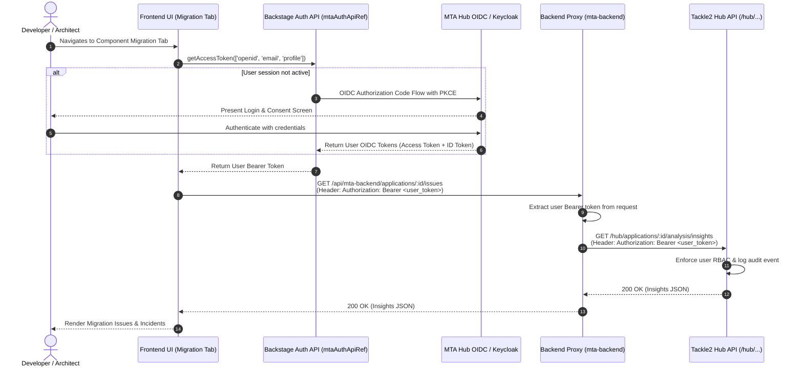
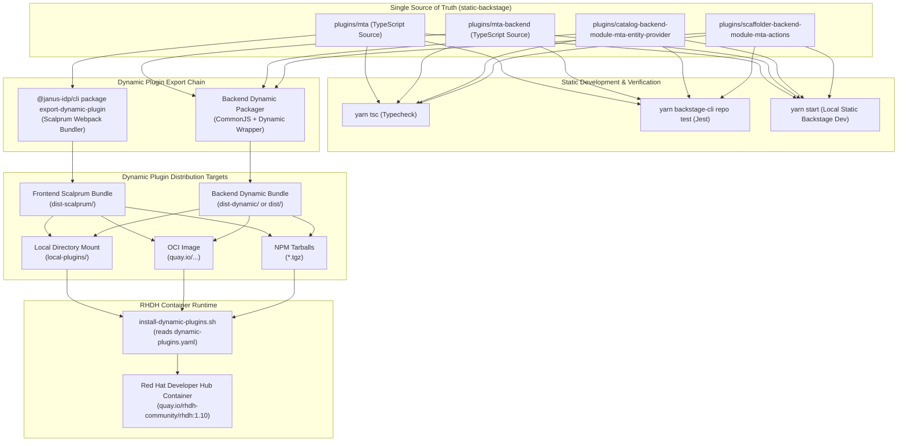

# Implementation Plan: Hooking MTA Plugins to a Live MTA Hub Instance
**Date:** 2026-09-22 (Updated from 2026-09-01)  
**Base Repository:** `static-backstage` (Static Backstage Monorepo)  
**Target Hub API Reference:** [`konveyor/tackle2-hub`](https://github.com/konveyor/tackle2-hub)  
**Target RHDH Runtime:** Red Hat Developer Hub (Dynamic Plugins via Scalprum / Janus IDP)

---

## Executive Summary

This document details the architectural and implementation plan to transition the **Migration Toolkit for Applications (MTA / Konveyor)** plugins from the current prototype implementation to a production-grade integration with a live **MTA Hub (Tackle2 Hub)** instance.

The architecture addresses three core requirements:
1. **User-Delegated Authentication (OIDC / OAuth2):** All user-initiated mutations and reads strictly forward the individual user's OIDC bearer token directly through to the MTA Hub. There is **no platform service account** for user actions, preserving Tackle2 RBAC and user-level audit trails.
2. **Modern Data Fetching & Reactive State:** Retiring the prototype's in-memory mock store and artificial delays in favor of a request-scoped backend proxy (`mta-backend`), a dedicated frontend API client (`MtaApiClient`), and reactive React hooks for live analysis task polling and issue tracking.
3. **Dual-Target Build Chain (Static Base → RHDH Dynamic Plugins):** Using the current `static-backstage` monorepo as the **Single Source of Truth (SSOT)**. The static plugins serve as the base for development and testing, while a dynamic plugin export step packages them into Scalprum-compatible dynamic plugins for deployment in Red Hat Developer Hub (RHDH).

---

## 1. Repository Structure Comparison

The plugins originated in `uxd_mta-for-rhdh` as prototype dynamic plugins and have been migrated into `static-backstage` as standard, static Backstage plugins built on the **New Backend System** and **New Frontend System**.

### Plugin Inventory & Location Mapping

| Plugin Role | Current Static Location (`static-backstage`) | Package Name (`static-backstage`) | Prototype Location (`uxd_mta-for-rhdh`) | Original Dynamic Package Name |
|---|---|---|---|---|
| **Frontend Plugin** | `plugins/mta` | `@internal/backstage-plugin-mta` | `dynamic-plugins-root/red-hat-developer-hub-backstage-plugin-mta` | `@red-hat-developer-hub/backstage-plugin-mta-dynamic` |
| **Backend Plugin (Proxy)** | `plugins/mta-backend` | `@internal/backstage-plugin-mta-backend` | `local-plugins/mta-backend` | `@red-hat-developer-hub/backstage-plugin-mta-backend` |
| **Mock Hub Backend** | `plugins/mta-mock-hub-backend` | `@internal/backstage-plugin-mta-mock-hub-backend` | `local-plugins/mta-mock-hub` | `@red-hat-developer-hub/backstage-plugin-mta-mock-hub-backend` |
| **Catalog Entity Provider** | `plugins/catalog-backend-module-mta-entity-provider` | `@internal/backstage-plugin-catalog-backend-module-mta-entity-provider` | `local-plugins/mta-entity-provider` | `@red-hat-developer-hub/backstage-plugin-mta-entity-provider` |
| **Scaffolder Actions Module** | `plugins/scaffolder-backend-module-mta-actions` | `@internal/backstage-plugin-scaffolder-backend-module-mta-actions` | `local-plugins/mta-scaffolder-actions` | `@red-hat-developer-hub/backstage-plugin-mta-scaffolder-actions` |

### Architectural Differences

1. **Monorepo Integration vs. Fragmented Packages:**
   - In `uxd_mta-for-rhdh`, plugins were maintained as isolated packages with divergent `package.json` manifests, separate build commands, and pre-built artifacts checked into `local-plugins/`.
   - In `static-backstage`, all 5 plugins are workspace members of a unified Yarn Modern (v4) monorepo. Type checking (`yarn tsc`), linting, and testing (`yarn backstage-cli repo test`) run across all plugins simultaneously.

2. **Backend Architecture:**
   - In `static-backstage`, all backend plugins and modules use the **New Backend System**:
     - `createBackendPlugin` for `mta-backend` and `mta-mock-hub-backend`.
     - `createBackendModule` for `catalogModuleMtaEntityProvider` (extending `catalogProcessingExtensionPoint`) and `scaffolderModuleMtaActions` (extending `scaffolderActionsExtensionPoint` from `@backstage/plugin-scaffolder-node/alpha`).
     - Registration in `packages/backend/src/index.ts` via `backend.add(import('...'))`.

3. **Frontend Architecture:**
   - In `static-backstage`, the frontend plugin uses the **New Frontend System** (`plugins/mta/src/alpha.tsx`):
     - `mtaEntityContent`: `EntityContentBlueprint` mounted on `Component` entities at `/migration`.
     - `mtaHomeWidget`: `HomePageWidgetBlueprint` mounted as `mta-migration-cards`.
     - `mtaPage`: `PageBlueprint` mounted at `/mta`.

---

## 2. Architecture Overview

```mermaid
flowchart TB
    subgraph Browser["User Browser (Static Backstage or RHDH)"]
        UI["Migration Tab & Home Cards<br/>(plugins/mta)"]
        AuthApi["Backstage Auth API<br/>(mtaAuthApiRef / OIDC)"]
        ApiClient["MtaApiClient<br/>(Bearer Token Forwarder)"]
        UI --> ApiClient
        ApiClient --> AuthApi
    end

    subgraph BackstageBackend["Backstage Backend Server (Port 7007)"]
        MtaBackend["mta-backend Proxy<br/>(/api/mta-backend/*)"]
        EntityProvider["mta-entity-provider<br/>(Catalog Sync)"]
        Scaffolder["mta-scaffolder-actions<br/>(mta:register-application)"]
    end

    subgraph MTA["MTA Hub (Tackle2 Hub)"]
        IdP["OIDC Provider / Keycloak SSO"]
        TackleAPI["Tackle2 REST API (/hub/...)"]
        AppReg["Application Registry"]
        Analyzer["Task Engine (Kantra Analyzer)"]
        Archetypes["Archetypes & Target Profiles"]
    end

    AuthApi -.->|1. User Login (PKCE)| IdP
    IdP -.->|2. User Bearer Token| AuthApi
    ApiClient -->|3. REST + User Bearer Token| MtaBackend
    MtaBackend -->|4. Forward with User Bearer Token| TackleAPI
    Scaffolder -->|User-Scoped Token| TackleAPI
    EntityProvider -.->|Read-Only Sync / Client Credentials| TackleAPI
    TackleAPI --> AppReg
    TackleAPI --> Analyzer
    TackleAPI --> Archetypes
```

---

## 3. User-Delegated Authentication & OIDC Flow

### The Zero-Shared-Service-Account Principle

Tackle2 Hub enforces fine-grained Role-Based Access Control (RBAC) and immutable per-user audit trails on applications, tasks, credentials, and analysis results. Using a shared platform service account violates this trust boundary.

Therefore:
- **Every user action** (triggering analysis, viewing issues, registering apps, modifying targets) is authenticated with the end-user's personal OIDC bearer token.
- **Backstage backend acts purely as an authenticated proxy** that extracts the user's `Authorization: Bearer <token>` header, initializes a request-scoped client, and forwards the token to MTA Hub.
- If a user lacks permissions in MTA Hub, Tackle2 returns HTTP `401 Unauthorized` or `403 Forbidden`, which the backend proxy passes directly back to the frontend.

### Authentication Sequence



### Auth Configuration in `app-config.yaml`

```yaml
auth:
  environment: development
  providers:
    oidc:
      mta:
        development:
          metadataUrl: ${MTA_HUB_BASE_URL}/oidc/.well-known/openid-configuration
          clientId: ${MTA_OIDC_CLIENT_ID}
          clientSecret: ${MTA_OIDC_CLIENT_SECRET}
          scope: 'openid profile email'
          prompt: 'auto'
```

### Frontend API Reference (`plugins/mta/src/api/auth.ts`)

```typescript
import { createApiRef, OAuthApi, ProfileInfoApi, SessionApi } from '@backstage/core-plugin-api';

export const mtaAuthApiRef = createApiRef<OAuthApi & ProfileInfoApi & SessionApi>({
  id: 'plugin.mta.auth',
});
```

---

## 4. Tackle2 Hub REST API & Data Fetching Mapping

### Tackle2 Hub API Route Reference

Based on `konveyor/tackle2-hub` (`shared/api/*.go` and `shared/api/pkg.go`), the live MTA Hub exposes the following REST contracts under `/hub/`:

| Feature / Domain | Tackle2 Route | Method | Payload / Response Contract |
|---|---|---|---|
| **Application Inventory** | `/hub/applications`<br>`/hub/applications/:id` | `GET`<br>`POST` | **`TackleApplication`**: `{ id, name, description, repository: { kind, url, branch, path }, tags: TagRef[], identities: IdentityRef[], archetypes: Ref[] }` |
| **Archetypes & Match Criteria** | `/hub/archetypes`<br>`/hub/archetypes/:id` | `GET` | **`TackleArchetype`**: `{ id, name, description, criteria: TagRef[], tags: TagRef[], profiles: TargetProfile[] }` |
| **Target Profiles & Targets** | `/hub/targets`<br>`/hub/generators` | `GET` | **`TargetProfile`**: `{ id, name, generators: Ref[], analysisProfile: Ref }` |
| **Trigger Kantra Analysis** | `/hub/tasks` | `POST` | **`TackleTask`**: `{ addon: "analyzer", application: { id: appId }, data: { targets: string[], sources: string[], mode: { binary: false, withDeps: true } } }` |
| **Monitor Task Lifecycle** | `/hub/tasks/:id`<br>`/hub/tasks/:id/report` | `GET` | **`TackleTask`**: `{ id, state: "Created"\|"Pending"\|"Running"\|"Succeeded"\|"Failed", errors: TaskError[], started, terminated, activity: string[] }` |
| **Fetch Analysis Insights** | `/hub/applications/:id/analysis/insights` | `GET` | **`TackleInsight[]`**: `{ id, ruleset, rule, name, description, category, effort, incidents: IncidentRef[], links: Link[], labels: string[] }` |
| **Fetch Incidents & Snippets** | `/hub/analyses/insights/:id/incidents` | `GET` | **`TackleIncident[]`**: `{ id, insight, file, line, message, codeSnip, facts: Record<string, any> }` |
| **Fetch Dependencies** | `/hub/applications/:id/analysis/dependencies` | `GET` | **`TackleDependency[]`**: `{ name, version, provider, indirect, labels, sha }` |
| **Repository Credentials** | `/hub/identities` | `GET`<br>`POST` | **`TackleIdentity`**: `{ id, kind: "git"\|"mvn", name, user, password, key }` |

---

## 5. Component Implementation Architecture

### 5.1 Backend Proxy Plugin (`plugins/mta-backend`)

The backend plugin implements an authenticated proxy router mounted at `/api/mta-backend/*`. It maintains no long-lived service account token; it derives a client from each incoming request's `Authorization: Bearer <token>` header.

#### `TackleClient.ts` (`plugins/mta-backend/src/service/TackleClient.ts`)

```typescript
import fetch, { RequestInit } from 'node-fetch';
import type { LoggerService } from '@backstage/backend-plugin-api';
import type {
  TackleApplication,
  TackleArchetype,
  TackleTask,
  TackleInsight,
  TackleIncident,
} from './types';

export class TackleClient {
  private readonly baseUrl: string;
  private readonly token: string;
  private readonly logger?: LoggerService;

  constructor(options: { baseUrl: string; token: string; logger?: LoggerService }) {
    this.baseUrl = options.baseUrl.replace(/\/+$/, '');
    this.token = options.token;
    this.logger = options.logger;
  }

  private async request<T>(path: string, init?: RequestInit): Promise<T> {
    const url = `${this.baseUrl}${path.startsWith('/') ? path : `/${path}`}`;
    const res = await fetch(url, {
      ...init,
      headers: {
        Accept: 'application/json',
        'Content-Type': 'application/json',
        Authorization: `Bearer ${this.token}`,
        ...init?.headers,
      },
    });

    if (!res.ok) {
      const errorText = await res.text().catch(() => '');
      this.logger?.error(`Tackle API [${res.status} ${res.statusText}] at ${path}: ${errorText}`);
      const err = new Error(`Tackle API error [${res.status} ${res.statusText}]`);
      (err as any).status = res.status;
      (err as any).body = errorText;
      throw err;
    }

    return (await res.json()) as T;
  }

  getApplications(): Promise<TackleApplication[]> {
    return this.request<TackleApplication[]>('/hub/applications');
  }

  getApplication(id: number): Promise<TackleApplication> {
    return this.request<TackleApplication>(`/hub/applications/${id}`);
  }

  createApplication(app: Partial<TackleApplication>): Promise<TackleApplication> {
    return this.request<TackleApplication>('/hub/applications', {
      method: 'POST',
      body: JSON.stringify(app),
    });
  }

  getArchetypes(): Promise<TackleArchetype[]> {
    return this.request<TackleArchetype[]>('/hub/archetypes');
  }

  createAnalysisTask(appId: number, options: { targets: string[]; sources?: string[] }): Promise<TackleTask> {
    return this.request<TackleTask>('/hub/tasks', {
      method: 'POST',
      body: JSON.stringify({
        addon: 'analyzer',
        application: { id: appId },
        data: {
          targets: options.targets,
          sources: options.sources || [],
          mode: { binary: false, withDeps: true },
        },
      }),
    });
  }

  getTask(taskId: number): Promise<TackleTask> {
    return this.request<TackleTask>(`/hub/tasks/${taskId}`);
  }

  getInsights(appId: number): Promise<TackleInsight[]> {
    return this.request<TackleInsight[]>(`/hub/applications/${appId}/analysis/insights`);
  }

  getIncidents(insightId: number): Promise<TackleIncident[]> {
    return this.request<TackleIncident[]>(`/hub/analyses/insights/${insightId}/incidents`);
  }
}
```

#### `router.ts` (`plugins/mta-backend/src/router.ts`)

```typescript
import { LoggerService } from '@backstage/backend-plugin-api';
import express, { Router } from 'express';
import RouterBuilder from 'express-promise-router';
import yaml from 'js-yaml';
import { TackleClient } from './service/TackleClient';

export interface RouterOptions {
  logger: LoggerService;
  mtaBaseUrl?: string;
}

export async function createRouter(options: RouterOptions): Promise<Router> {
  const { logger, mtaBaseUrl = process.env.MTA_HUB_BASE_URL || 'http://localhost:8080' } = options;
  const router = RouterBuilder();
  router.use(express.json());

  const getClient = (req: express.Request): TackleClient => {
    const authHeader = req.headers.authorization;
    if (!authHeader || !authHeader.startsWith('Bearer ')) {
      const err = new Error('Unauthorized: Missing or invalid MTA user bearer token');
      (err as any).status = 401;
      throw err;
    }
    const token = authHeader.substring('Bearer '.length).trim();
    return new TackleClient({ baseUrl: mtaBaseUrl, token, logger });
  };

  // Proxy: List applications
  router.get('/applications', async (req, res) => {
    const client = getClient(req);
    const apps = await client.getApplications();
    res.json(apps);
  });

  // Proxy: Get single application
  router.get('/applications/:id', async (req, res) => {
    const client = getClient(req);
    const app = await client.getApplication(Number(req.params.id));
    res.json(app);
  });

  // Proxy: Create application
  router.post('/applications', async (req, res) => {
    const client = getClient(req);
    const app = await client.createApplication(req.body);
    res.status(201).json(app);
  });

  // Proxy: Archetypes
  router.get('/archetypes', async (req, res) => {
    const client = getClient(req);
    const archetypes = await client.getArchetypes();
    res.json(archetypes);
  });

  // Proxy: Trigger analysis
  router.post('/applications/:id/analyze', async (req, res) => {
    const client = getClient(req);
    const task = await client.createAnalysisTask(Number(req.params.id), req.body);
    res.status(201).json(task);
  });

  // Proxy: Poll task
  router.get('/tasks/:id', async (req, res) => {
    const client = getClient(req);
    const task = await client.getTask(Number(req.params.id));
    res.json(task);
  });

  // Proxy: Application issues / insights
  router.get('/applications/:id/issues', async (req, res) => {
    const client = getClient(req);
    const insights = await client.getInsights(Number(req.params.id));
    res.json(insights);
  });

  // Proxy: Incidents for an insight
  router.get('/insights/:id/incidents', async (req, res) => {
    const client = getClient(req);
    const incidents = await client.getIncidents(Number(req.params.id));
    res.json(incidents);
  });

  // Existing entity descriptor generation endpoint
  router.get('/entity/:name', (req, res) => {
    const { name } = req.params;
    const repoUrl = typeof req.query.repoUrl === 'string' ? req.query.repoUrl : '';
    const tags = typeof req.query.tags === 'string' ? req.query.tags.split(',').filter(Boolean) : [];

    const doc = {
      apiVersion: 'backstage.io/v1alpha1',
      kind: 'Component',
      metadata: {
        name,
        description: 'Application managed by MTA',
        annotations: repoUrl ? {
          'mta.konveyor.io/repo-url': repoUrl,
          'backstage.io/source-location': `url:${repoUrl}`,
        } : {},
        tags: tags.length > 0 ? tags : undefined,
        labels: { 'mta/migration-status': 'Not-Started' },
      },
      spec: {
        type: 'service',
        lifecycle: 'production',
        owner: 'user:default/guest',
        system: 'mta-portfolio',
      },
    };

    res.setHeader('Content-Type', 'text/yaml');
    res.send(yaml.dump(doc, { lineWidth: -1 }));
  });

  return router;
}
```

---

### 5.2 Frontend Plugin (`plugins/mta`)

#### Modern Data Fetching Client (`plugins/mta/src/api/MtaApiClient.ts`)

```typescript
import { DiscoveryApi, OAuthApi } from '@backstage/core-plugin-api';
import type {
  TackleApplication,
  TackleArchetype,
  TackleTask,
  TackleInsight,
  TackleIncident,
} from './types';

export class MtaApiClient {
  constructor(
    private readonly discoveryApi: DiscoveryApi,
    private readonly authApi: OAuthApi,
  ) {}

  private async fetchWithAuth<T>(path: string, init?: RequestInit): Promise<T> {
    const baseUrl = await this.discoveryApi.getBaseUrl('mta-backend');
    const token = await this.authApi.getAccessToken(['openid', 'email', 'profile']);

    const res = await fetch(`${baseUrl}${path}`, {
      ...init,
      headers: {
        Accept: 'application/json',
        'Content-Type': 'application/json',
        Authorization: `Bearer ${token}`,
        ...init?.headers,
      },
    });

    if (!res.ok) {
      const errText = await res.text().catch(() => '');
      throw new Error(`MTA backend request failed [${res.status}]: ${errText}`);
    }

    return (await res.json()) as T;
  }

  getApplication(id: number): Promise<TackleApplication> {
    return this.fetchWithAuth<TackleApplication>(`/applications/${id}`);
  }

  getArchetypes(): Promise<TackleArchetype[]> {
    return this.fetchWithAuth<TackleArchetype[]>('/archetypes');
  }

  triggerAnalysis(appId: number, targets: string[]): Promise<TackleTask> {
    return this.fetchWithAuth<TackleTask>(`/applications/${appId}/analyze`, {
      method: 'POST',
      body: JSON.stringify({ targets }),
    });
  }

  getTask(taskId: number): Promise<TackleTask> {
    return this.fetchWithAuth<TackleTask>(`/tasks/${taskId}`);
  }

  getIssues(appId: number): Promise<TackleInsight[]> {
    return this.fetchWithAuth<TackleInsight[]>(`/applications/${appId}/issues`);
  }

  getIncidents(insightId: number): Promise<TackleIncident[]> {
    return this.fetchWithAuth<TackleIncident[]>(`/insights/${insightId}/incidents`);
  }
}
```

#### Reactive Polling Hook for Analysis Tasks (`plugins/mta/src/hooks/useMtaAnalysis.ts`)

```typescript
import { useEffect, useState, useCallback, useRef } from 'react';
import type { TackleTask } from '../types';
import { MtaApiClient } from '../api/MtaApiClient';

const POLL_INTERVAL_MS = 3000;

export function useMtaAnalysis(apiClient: MtaApiClient, taskId?: number) {
  const [task, setTask] = useState<TackleTask | null>(null);
  const [loading, setLoading] = useState(false);
  const [error, setError] = useState<Error | null>(null);
  const pollTimerRef = useRef<NodeJS.Timeout>();

  const fetchTask = useCallback(async () => {
    if (!taskId) return;
    try {
      const updated = await apiClient.getTask(taskId);
      setTask(updated);
      if (updated.state === 'Created' || updated.state === 'Pending' || updated.state === 'Running') {
        pollTimerRef.current = setTimeout(fetchTask, POLL_INTERVAL_MS);
      }
    } catch (err: any) {
      setError(err);
    } finally {
      setLoading(false);
    }
  }, [apiClient, taskId]);

  useEffect(() => {
    if (!taskId) {
      setTask(null);
      return;
    }
    setLoading(true);
    fetchTask();
    return () => {
      if (pollTimerRef.current) clearTimeout(pollTimerRef.current);
    };
  }, [taskId, fetchTask]);

  return { task, loading, error, refetch: fetchTask };
}
```

#### Retiring Prototype Store & Simulators
- **Remove in-memory store:** Deprecate `MtaStore.tsx` and `mockData.ts`.
- **Remove artificial discovery delay:** Drop `DISCOVERY_DELAY_MS` (20s simulated timer).
- **Drive Phase State Machine from Hub Data:**
  - `PhaseNotStarted`: Application not yet registered in Tackle2 Hub (`konveyor.io/application-id` annotation absent).
  - `PhaseDiscovery`: Application created in Tackle; repository clone / discovery tags in progress.
  - `PhasePathSelection`: Tags present, matching archetypes retrieved from `GET /archetypes`.
  - `PhaseAnalyzing`: Active analysis task running; live polling via `useMtaAnalysis`.
  - `PhaseActive` / `PhaseCompleted`: Task state `Succeeded`; issues rendered via `GET /applications/:id/issues`.
  - `PhaseFailed`: Task state `Failed` or repository error returned by Tackle.

---

### 5.3 Scaffolder Actions Module (`plugins/scaffolder-backend-module-mta-actions`)

When developers register an application through Backstage Software Templates (`mta:register-application`), the template executes within the user's session:

1. **User Token Propagation:** The action extracts the user's OAuth token from template context (`ctx.secrets?.mtaToken` or execution token).
2. **Direct Registration:** Calls `POST /hub/applications` on MTA Hub with the user's token.
3. **Outputs:** Sets `applicationId`, `applicationName`, and `entityRef` for downstream steps.

---

### 5.4 Catalog Entity Provider (`plugins/catalog-backend-module-mta-entity-provider`)

For automatic background ingestion of newly registered MTA applications into the Backstage Software Catalog:
- Because the entity provider runs in a scheduled background task without an active user session, it uses an authorized cluster integration:
  1. **Option A (Cluster OIDC Client Credentials):** A read-only service account for catalog discovery if enabled on the cluster.
  2. **Option B (Annotation-Driven Ingestion):** Scaffolder template directly commits the `catalog-info.yaml` with `konveyor.io/application-id` annotation, while the entity provider syncs runtime metadata.
- Entities are emitted with canonical annotations:
  - `konveyor.io/application-id`: `"${app.id}"`
  - `mta.konveyor.io/repo-url`: `"${app.repository.url}"`
  - `backstage.io/source-location`: `"url:${app.repository.url}"`

---

## 6. RHDH Dynamic Plugins & Dual-Target Build Chain

### Strategic Objective: Static Monorepo as Single Source of Truth

The `static-backstage` monorepo serves as the **core development platform**. Developers write standard TypeScript, test with standard Jest suites, and run the static app locally. A dedicated **build & export chain** transforms the static plugins into dynamic plugin artifacts consumed by Red Hat Developer Hub without code duplication.



### Dynamic Plugin Mechanisms in RHDH

1. **Frontend Plugins (Scalprum / Module Federation):**
   - RHDH's frontend dynamically loads plugins at runtime via **Scalprum** (Red Hat's micro-frontend framework built on Webpack Module Federation).
   - Requires `scalprum` configuration in `package.json`:
     ```json
     "scalprum": {
       "name": "red-hat-developer-hub.backstage-plugin-mta",
       "exposedModules": {
         "PluginRoot": "./src/index.ts",
         "MtaAlpha": "./src/alpha.tsx"
       }
     }
     ```
   - Build output: `dist-scalprum/` containing chunked webpack bundles.

2. **Backend Plugins & Modules:**
   - Packaged as CommonJS / dynamic modules with dependencies bundled or listed in `dependencies`.
   - In modern RHDH (1.4+ / 1.10), the New Backend System is natively supported: dynamic plugins export their `createBackendPlugin` or `createBackendModule` directly.

### Dynamic Plugins Configuration for RHDH

#### `configs/dynamic-plugins/dynamic-plugins.override.yaml`

```yaml
includes:
  - dynamic-plugins.default.yaml

plugins:
  # MTA Frontend Dynamic Plugin
  - package: ./local-plugins/red-hat-developer-hub-backstage-plugin-mta
    disabled: false
    pluginConfig:
      dynamicPlugins:
        frontend:
          red-hat-developer-hub.backstage-plugin-mta:
            mountPoints:
              - mountPoint: entity.page.mta/cards
                importName: MtaAlpha
            entityTabs:
              - path: /migration
                title: Migration
                mountPoint: entity.page.mta

  # MTA Backend Proxy Plugin
  - package: ./local-plugins/mta-backend
    disabled: false
    pluginConfig:
      mta:
        baseUrl: ${MTA_HUB_BASE_URL}

  # MTA Catalog Entity Provider Module
  - package: ./local-plugins/mta-entity-provider
    disabled: false

  # MTA Scaffolder Actions Module
  - package: ./local-plugins/mta-scaffolder-actions
    disabled: false

  # In-memory Mock Hub (Disabled for Live Cutover)
  - package: ./local-plugins/mta-mock-hub
    disabled: true
```

### RHDH Dev and Run Chain (High-Level Plan)

- **Decoupled Workflow:** Static plugin development and verification remain fast in `static-backstage` via standard Backstage CLI.
- **Export Target:** An automated npm script or build recipe (e.g. `yarn export:dynamic`) invokes `@janus-idp/cli` to produce the `dist-scalprum` and dynamic packages into an export output directory.
- **Run Chain:**
  - Podman / Docker Compose launches the RHDH container (`quay.io/rhdh-community/rhdh:1.10`).
  - The init container or `install-dynamic-plugins.sh` mounts the exported dynamic plugins from the local directory or OCI registry.
  - The RHDH instance starts with live MTA Hub integration.
- *Note:* The full RHDH container execution chain is isolated from the static repo; details of container compose files and local registries will be formalized in follow-up build tooling.

---

## 7. Phased Implementation Roadmap

| Phase | Component | Key Milestones & Deliverables | Verification Check |
|---|---|---|---|
| **Phase 1: Types & Auth Contract** | `plugins/mta`<br>`plugins/mta-backend` | - Mirror Tackle2 Go domain models in `types.ts`.<br>- Configure OIDC provider in `app-config.yaml`.<br>- Register `mtaAuthApiRef` in frontend. | `yarn tsc` passes; auth popup/token retrieval verified. |
| **Phase 2: Backend Authenticated Proxy** | `plugins/mta-backend` | - Implement `TackleClient` with request-scoped Bearer token injection.<br>- Expose `/applications`, `/archetypes`, `/tasks`, `/issues`, `/incidents`. | Integration test with mocked Tackle2 Hub returning 200/401. |
| **Phase 3: Frontend Data Fetching & Hooks** | `plugins/mta` | - Implement `MtaApiClient` utilizing `mtaAuthApiRef`.<br>- Implement `useMtaAnalysis` polling hook.<br>- Refactor `MigrationTab` and phase components to consume live API.<br>- Retire `MtaStore.tsx` and artificial 20s delay. | `yarn backstage-cli repo test plugins/mta`; UI transitions correctly on live data. |
| **Phase 4: Scaffolder & Catalog Integration** | `plugins/scaffolder-...`<br>`plugins/catalog-...` | - Update `mta:register-application` to forward user token.<br>- Ensure catalog provider synchronizes `konveyor.io/application-id`. | Run Scaffolder template; verify app created in Tackle and Catalog. |
| **Phase 5: Dynamic Plugin Export Chain** | Monorepo Root / Plugins | - Configure `scalprum` block in `plugins/mta/package.json`.<br>- Add `@janus-idp/cli` export pipeline script.<br>- Generate export artifacts (`dist-scalprum/`, `dist-dynamic/`). | Artifact verification: check `dist-scalprum` bundles generated cleanly. |
| **Phase 6: Live Cutover & Verification** | Deployment Configs | - Point `MTA_HUB_BASE_URL` to live Tackle2 Hub.<br>- Disable `mta-mock-hub-backend`.<br>- End-to-end user-delegated migration workflow validation. | End-to-end verification in both static Backstage and RHDH container. |
